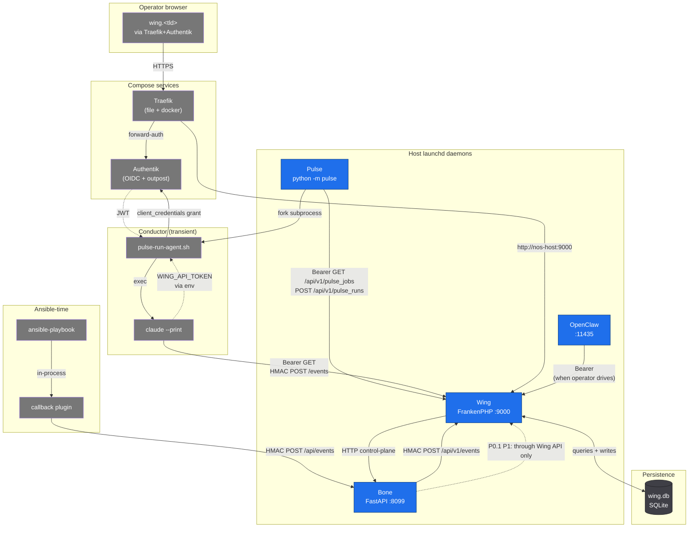
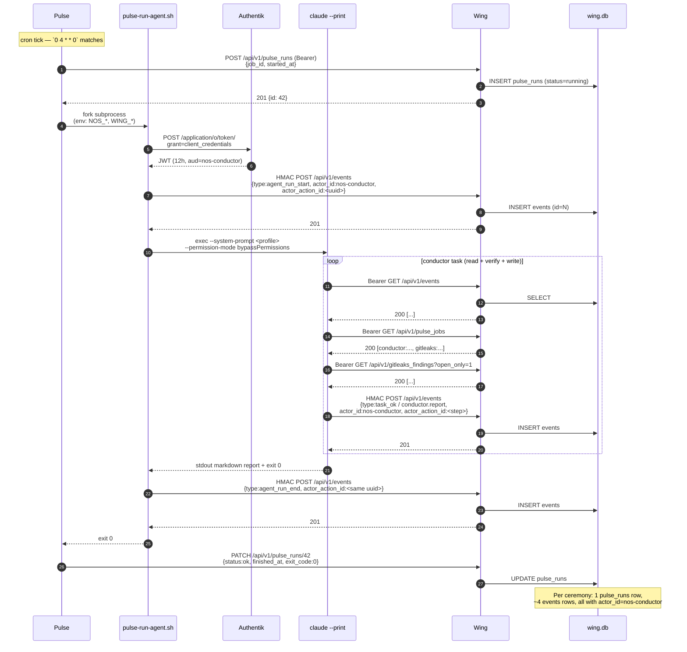

# Anatomy runtime flow — Bone, Wing, Pulse, Conductor

> **Audience:** operators + future agents who need to understand who does
> what, who can write where, and who trusts whom.
>
> **Scope:** the four host-side daemons (Bone, Wing, Pulse, OpenClaw) plus
> the agent runner that joins them under a non-operator identity. Compose
> services (Authentik, Postgres, Traefik, etc.) appear only as collaborators.
>
> Last reconciled: 2026-05-07 — after Phase 5 ceremony PASS.

---

## TL;DR

```
            ┌──────────────────────┐
            │  wing.db (SQLite)    │   ←  the single source of truth
            │  events, pulse_runs, │      for state + telemetry + audit
            │  gitleaks_findings,  │
            │  api_tokens, …       │
            └──────────┬───────────┘
                       │
          ┌────────────┴────────────┐
          ↑ writes                  ↓ reads
   ┌─────────────┐           ┌─────────────┐
   │    Bone     │           │    Wing     │
   │ FastAPI     │           │ Nette PHP   │
   │ HMAC ingest │           │ Bearer API  │
   │ port 8099   │           │ port 9000   │
   └──────┬──────┘           └──────▲──────┘
          ↑ HMAC                    │ Bearer / forward-auth
          │                         │
   ┌──────┴────────┐    ┌───────────┴───────────┐
   │ Ansible       │    │ Conductor agent       │
   │ callback      │    │ (claude under         │
   │ plugin        │    │  Authentik client_    │
   └───────────────┘    │  credentials)         │
                        └───────────▲───────────┘
                                    │ subprocess
                              ┌─────┴──────┐
                              │   Pulse    │
                              │ scheduler  │
                              │ (Python)   │
                              └────────────┘
```

The whole anatomy is built around **one SQLite file** (`~/wing/app/data/wing.db`).
Every other piece earns its place by doing one of three things to that file:
**writing telemetry**, **serving reads**, or **scheduling new writers**.

---

## Components

### Bone — `eu.thisisait.nos.bone` launchd, port `8099`

FastAPI bridge running on the host. Two responsibilities:

1. **Ingest path for the Ansible callback plugin.** Ansible runs emit
   `playbook_*` / `task_*` / `handler_*` events; the callback plugin POSTs
   them HMAC-signed to Bone, Bone forwards them HMAC-signed to Wing
   `/api/v1/events`.
2. **Control-plane proxy.** Wing presenters delegate
   "do something stateful on the host" calls (read mkcert CA, run
   `nos_authentik` blueprint sweep, query Qdrant) to Bone via the
   `BoneClient.php` HTTP layer. Bone is allowed in the host's
   security context; Wing PHP isn't.

Bone never reads or writes wing.db directly anymore (P0.1, 2026-05-05).
All persistence flows through Wing's HTTP API. The CI lint enforcing this
is a follow-up TODO.

### Wing — `eu.thisisait.nos.wing` launchd, FrankenPHP at port `9000`

Nette PHP dashboard + REST API. Single binary FrankenPHP serves Caddy +
PHP 8.5; the Track-A FPM-container + nginx-sidecar pair is gone (A3.5).

Two surfaces, gated by Traefik:

- **Operator UI** (browser → `wing.<tld>`) — Authentik forward-auth.
  Tier-1 admin pages: `/state`, `/migrations`, `/upgrades`, `/coexistence`,
  `/timeline`, `/audit`, `/inbox`, `/approvals`.
- **REST API** (`http://127.0.0.1:9000/api/v1/...`) — Bearer token
  (per-actor row in `api_tokens`) for everything except
  `POST /api/v1/events`, which uses HMAC (callback plugin and conductor
  both speak HMAC for ingest; Bearer is for reads).

### Pulse — `eu.thisisait.nos.pulse` launchd, no public port

Tiny Python daemon (`python -m pulse`). Polls Wing
`GET /api/v1/pulse_jobs` once a minute, computes which jobs are due
(crontab-style schedules + jitter), forks a subprocess runner, and reports
back via `POST /api/v1/pulse_runs` (start) and `PATCH /api/v1/pulse_runs/{id}`
(finish).

Pulse never invokes Bash or HTTP itself — it only spawns a single
subprocess per job and watches for its exit code. The job's command +
env are templated by the plugin loader from the manifest's `pulse:` block.

Two jobs registered today:

| Job id | Schedule | Runner | What it does |
|---|---|---|---|
| `gitleaks:nightly-scan` | `0 3 * * *` | `files/anatomy/plugins/gitleaks/skills/run-gitleaks.sh` | gitleaks → Wing `/gitleaks_findings` |
| `conductor:self-test-001` | `0 4 * * 0` (Sun 04:00) | `files/anatomy/scripts/pulse-run-agent.sh` | Authentik client_credentials → claude → Wing `/events` |

### OpenClaw — `ai.openclaw.gateway` launchd

The operator's local LLM gateway. Backed by Ollama 0.19+ MLX. Not part
of the audit chain, but gets a Wing `api_tokens` row of its own so it can
read state and write events when the operator drives it interactively.

### Conductor — *not a daemon*, a transient identity

The conductor isn't a long-running process. It's a **subprocess invoked
by Pulse** under an Authentik client_credentials identity:

```
Pulse (cron 0 4 * * 0)
   ↓ subprocess
files/anatomy/scripts/pulse-run-agent.sh
   ↓ POST /application/o/token/  (client_credentials grant)
Authentik nos-conductor client → JWT
   ↓ exec claude --print --system-prompt … --permission-mode bypassPermissions
files/anatomy/agents/conductor.yml + NOS_CONDUCTOR_TASK
   ↓ inside claude: bash + curl with WING_API_TOKEN + WING_EVENTS_HMAC_SECRET
Wing /api/v1/events  (HMAC for POST, Bearer for GET)
   ↓ insert with actor_id=nos-conductor + actor_action_id=<uuid>
wing.db
```

Every claude invocation is **stateless** — same env + same task = same
behaviour. There is no session state, no inbox watcher, no daemon mode.
The "agentic loop" is:
*Pulse fires → conductor reads + writes once → process exits → done.*

Periodicity comes from Pulse, not from the agent.

### Ansible callback plugin — `callback_plugins/wing_telemetry.py`

Not a daemon; a plugin Ansible loads in-process when you run
`ansible-playbook`. Emits one event per task / handler / play / playbook
to Bone via HTTP. Bone HMAC-forwards to Wing. Falls back to
`~/.nos/events.jsonl` if Bone is unreachable. Always writes
`source: "callback"` and `actor_id: "ansible-provisioned"`.

---

## Trust boundaries

Three auth schemes, one for each lane:

| Scheme | Used by | Token shape | What it gates |
|---|---|---|---|
| **HMAC** | callback plugin, conductor (POST /events), Bone (forwarding) | shared secret `bone_secret` (= `WING_EVENTS_HMAC_SECRET`) | telemetry ingest only — `POST /api/v1/events` |
| **Bearer** | every reader: operator curl, Wing dashboard server-side, conductor reads, OpenClaw reads, Pulse → Wing (`/pulse_jobs` etc.) | per-actor row in `api_tokens` (SHA-256 of plaintext, plaintext stored in env) | every `GET` on Wing API; non-events `POST` (gitleaks ingest, pulse_runs) |
| **OIDC forward-auth** | browser users at `wing.<tld>` | Authentik session cookie on `.<tld>` | Wing dashboard UI |
| **OIDC client_credentials** | Conductor (one hop, transient) | Authentik JWT, 12h validity | obtaining permission to *be* the conductor in the first place; Wing currently doesn't verify this token (Bearer in `api_tokens` is the gate that matters), but A11/A12 will tighten this — JWT-bound writes |

The `WING_EVENTS_HMAC_SECRET = bone_secret` equality is **deliberate and
load-bearing**: Bone signs outbound, Wing verifies inbound, with one shared
operator-controlled secret. Don't split it without rewiring both sides.

---

## Component map (who calls whom)



---

## Sequence: Phase 5 ceremony (autonomous run)

This is what happens when `conductor:self-test-001` fires under cron — i.e.
the Pulse-driven path that today is registered but has not yet auto-fired.
The manual B-variant we ran 2026-05-07 follows the same diagram from
`pulse-run-agent.sh` onward.



---

## What writes to wing.db

The audit story matters. Every wing.db write must answer: *who, when, why,
correlated with what?* The columns enabling that are
`actor_id` + `actor_action_id` + `acted_at` (X.1.a, 2026-05-08).

| Writer | Path | Auth | actor_id | Typical event types |
|---|---|---|---|---|
| Ansible callback plugin | Bone → Wing /events | HMAC | `ansible-provisioned` | `playbook_start/end`, `play_start/end`, `task_ok/changed/failed`, `handler_*` |
| Conductor (runner-emitted) | runner → Wing /events | HMAC | `nos-conductor` | `agent_run_start`, `agent_run_end` |
| Conductor (claude-emitted) | claude curl → Wing /events | HMAC | `nos-conductor` | `task_ok` (currently shimmed; `conductor.*` types pending VALID_TYPES extension) |
| Pulse daemon | Pulse → Wing /pulse_runs | Bearer | `pulse-daemon` | (separate table — pulse_runs) |
| Gitleaks runner | runner → Wing /gitleaks_findings | Bearer | `pulse-daemon` (via Pulse) | (separate table — gitleaks_findings) |
| Operator manual | curl → Wing /events | HMAC | self-supplied | one-off probes |
| OpenClaw (when operator drives) | OpenClaw → Wing | Bearer | `openclaw` | per-prompt agent runs (post-A8.B) |

`actor_action_id` is a UUID minted **once per logical action** — for the
conductor that means start + step1..N + end all share one UUID, so
`SELECT * FROM events WHERE actor_action_id=<uuid> ORDER BY ts` reconstructs
the whole run as a coherent story.

---

## What's wired but not yet auto-firing

| Item | State | Why it matters |
|---|---|---|
| `conductor:self-test-001` Pulse cron | registered, `next_fire_at=null` | Variant A from the 2026-05-07 plan — daemon-driven ceremony. Manual B-variant proved the ceremony works; cron-driven proves Pulse triggers it. |
| `EventRepository::VALID_TYPES` for `conductor.*` | not yet whitelisted | Conductor falls back to `task_ok` / `agent_run_end`. Cosmetic; full attribution preserved via `actor_id`. |
| Wing `/approvals` UI | A8.c.2 stub presenter live, no rows handled | Once conductor reports findings to `/inbox`, operator needs `/approvals` to act. P1 this arc. |
| Bone CI lint forbidding direct sqlite3 | not enforced | P0.1 follow-up. The pattern is gone from the code; lint is the seal. |

## What's structurally complete

| Item | Where to read more |
|---|---|
| Bone events ingest with full audit | `files/anatomy/bone/clients/wing.py`, `files/anatomy/wing/app/Presenters/Api/EventsPresenter.php` |
| Wing API surface (87 paths, contract-pinned) | `files/anatomy/skills/contracts/wing.openapi.yml` |
| Pulse daemon + cron parser | `files/anatomy/pulse/pulse/daemon.py` |
| Conductor agent profile + runner | `files/anatomy/agents/conductor.yml`, `files/anatomy/scripts/pulse-run-agent.sh` |
| Plugin loader aggregator (consumer_block, agent_profile, app_manifest) | `files/anatomy/module_utils/load_plugins.py`, `tools/aggregator-dry-run.py` |
| A10 attribution columns + presenter | `files/anatomy/wing/db/schema-extensions.sql`, `files/anatomy/wing/app/Presenters/AuditPresenter.php` |
| Phase 5 ceremony PASS | this doc + `wing.db` rows 4-7 (run_id `conductor-phase5-ceremony-1778141913`) |

---

## Reading list — code first, then docs

If you have 30 minutes, read these in order:

1. `files/anatomy/scripts/pulse-run-agent.sh` — 184 lines, the whole
   conductor flow at concrete level.
2. `files/anatomy/wing/app/Presenters/Api/EventsPresenter.php` — HMAC ingest,
   actor attribution, VALID_TYPES gate.
3. `files/anatomy/pulse/pulse/daemon.py` — cron parsing, subprocess fork,
   pulse_runs roundtrip.
4. `files/anatomy/agents/conductor.yml` — system prompt, capabilities,
   Pulse job declaration.
5. `docs/agent-operable-nos.md` — the doctrine that frames why all the
   above exists.

If you only have 5 minutes, read this file. If you only have 1 minute,
read the TL;DR at the top.
