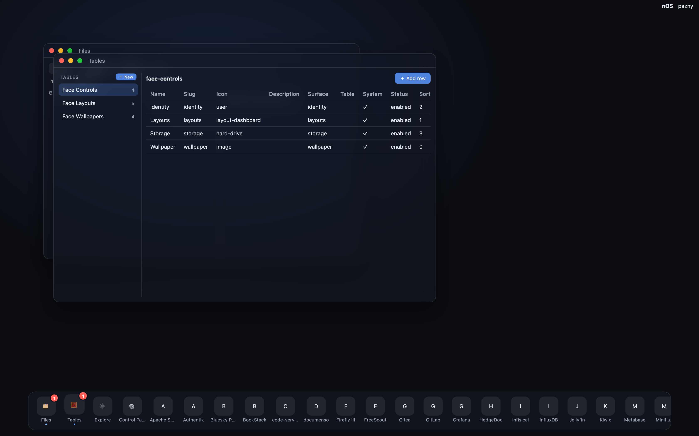
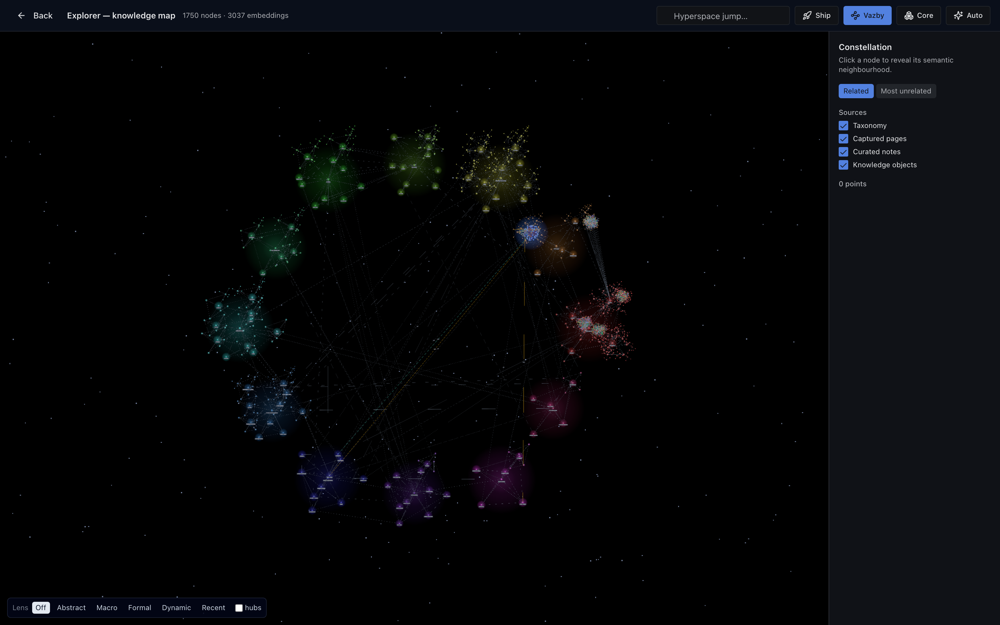

nOS has been described in prose for its whole life. Every devlog entry so far has
argued about doctrine, traps, and structure — and never once shown the thing. Two
surfaces are now finished enough to be worth looking at.

## The face is a desktop, not a launcher

That is the live shell, not a mockup. Worth noticing:

- **Those are real windows** — drag, snap to thirds or 2×2, tile with live gutters,
  minimise to the taskbar with a live thumbnail. The WM is the shell's own.
- **Tables is reading production data.** The `face-controls` rows on screen are the
  desktop's *own* configuration, served from KEAP's DataTables — the control panel
  is data, not hardcoded UI. Add a row, get a control.
- **The dock is the whole platform.** Files, Tables and Explore are native apps
  calling Bone's VFS and KEAP's API directly; everything after them is one of 37
  services, each opening as an iframe window rather than a lost browser tab.
- **The badges are real** — two windows open, two dock badges.

The unglamorous part is that the dock was empty for weeks. The hub emitted `id`,
the shell filtered on `slug`, and the intersection was nothing. A desktop with zero
apps looks like an unfinished desktop, not a one-line bug.

## The cortex is a map you can fly through

1750 nodes, 3037 embeddings. Every dot is a knowledge object and **position is
meaning**: nodes are laid out by their embedding, so the coloured blobs are domains
that clustered themselves — the physics cluster is dense because physics *is*
densely cross-referenced, not because someone drew it that way. The long faint lines
are typed cross-domain relations (Track R3), the edges that jump between clusters
rather than staying inside one.

The bright dense knot on the right is the mathematics import; the tight blue sphere
above it is a domain that arrived through a different pipeline and has not been
woven into the cross-domain relation layer yet. The map does not flatter itself —
you can see which regions are curated and which are merely present.

Sources are filterable (taxonomy, captured pages, curated notes, knowledge objects),
because the same canvas holds a curated encyclopedia *and* whatever the browser
extension captured this morning, and those deserve to be separable.

## The pipeline behind the pictures

Both images are committed to the repo at `docs/devlog/nos-core/media/` and
referenced from this post as ordinary relative markdown, which means they render on
GitHub, in the compiled bundle, and on the live site from one source.

That last part needed building. The devlog sync handled post *text* only; images had
nowhere to go. The rule now matches the rest of the devlog doctrine — **repo is the
source of truth, WordPress is disposable presentation**:

- The compiler resolves each ``, refuses to compile if the file
  is missing, and records its **sha256** in the bundle.
- The sync uploads by a slug derived from the repo **filename**, storing that hash
  on the attachment. Unchanged image, no upload. Changed bytes, replace.
- Media hashes fold into the post's content hash, so **replacing a screenshot marks
  the post dirty even though its markdown never changed** — otherwise a new image
  would upload and no post would ever point at it.
- An attachment nobody references any more is deleted, under the same guards the
  post orphan-collector uses.

Which delivers the workflow that was actually asked for: **overwrite the file, keep
the name, re-run the playbook, the live post shows the new picture.** No WordPress
step, no post edit, no broken link.

One honest omission: there is no screenshot of the semantic lens here. The lens
*computes* — exemplar axes, centrality, clusters, all landed — but the render half
is still queued, so switching it on changes the map's meaning without changing its
appearance. A picture of it would imply something that isn't true yet.
