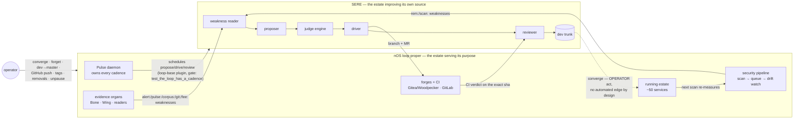
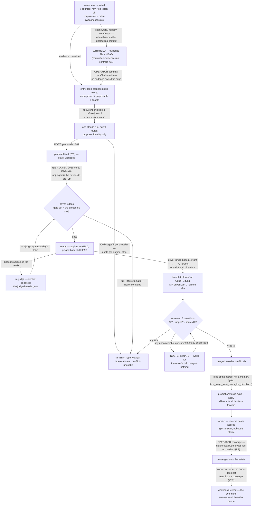
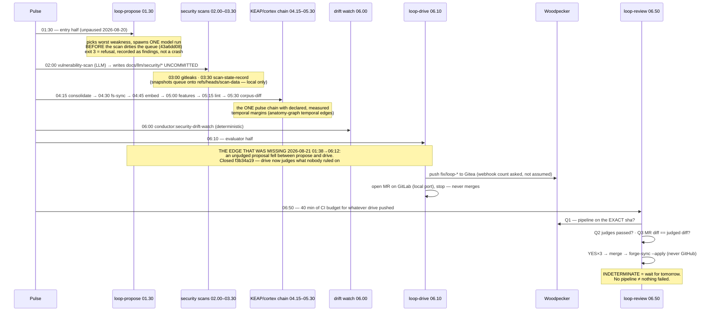
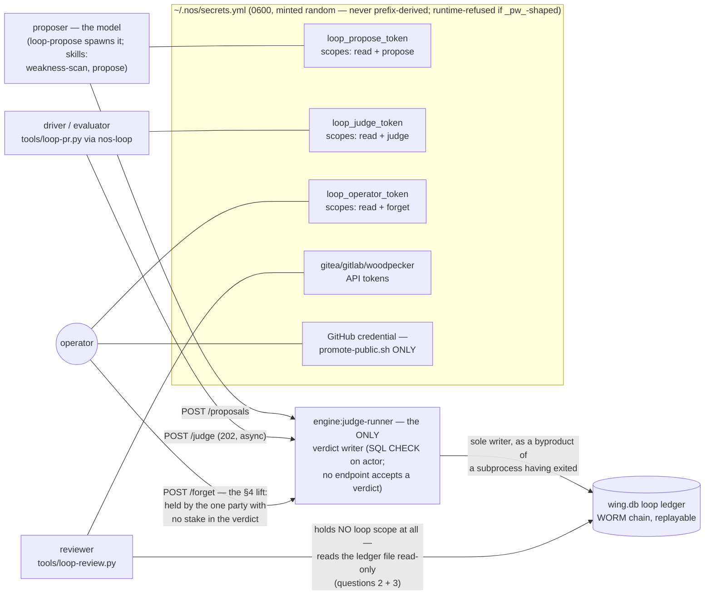
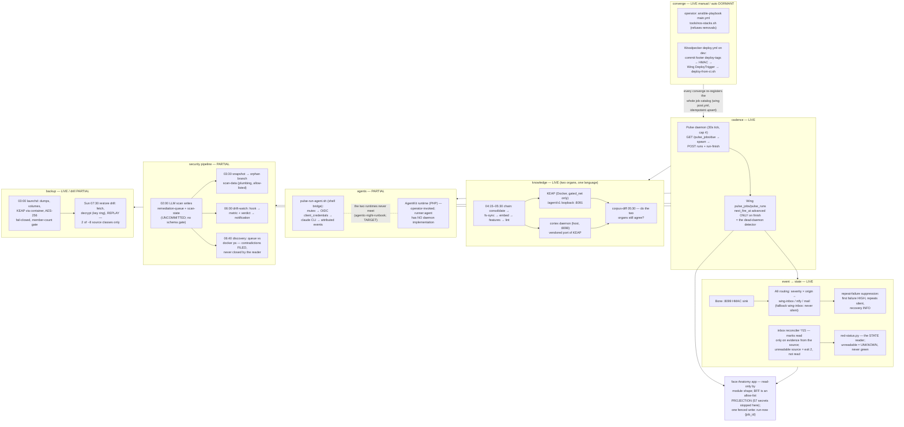
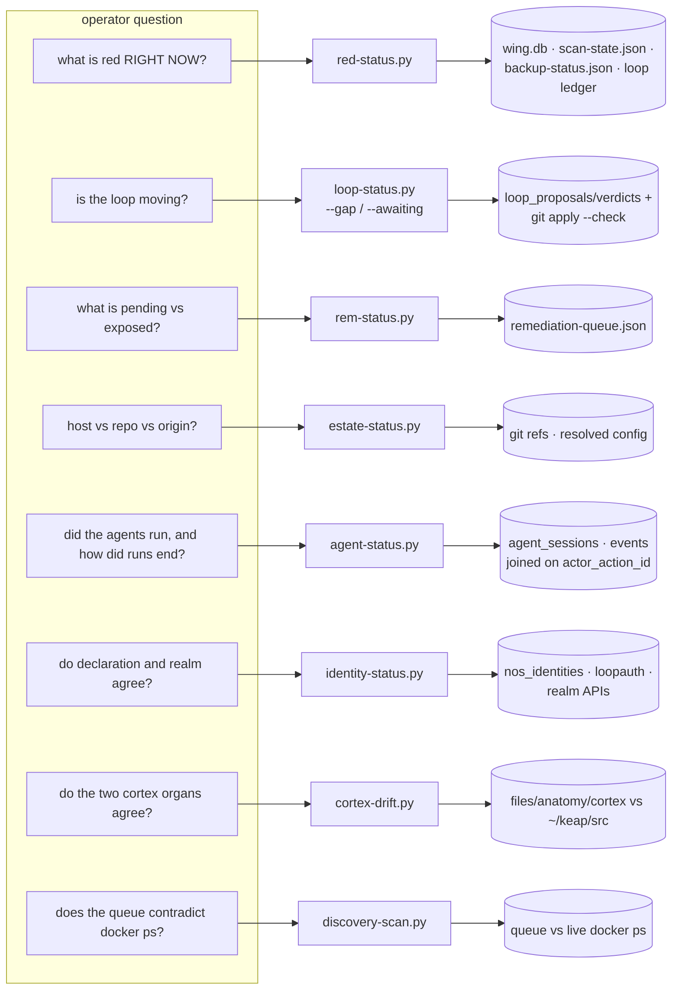

# The two loops — sequence doctrine

> Status: doctrine, opened 2026-08-21. This file is the estate's only statement
> of the *sequence* — which step hands to which, holding which identity,
> refusing what. Component behaviour stays owned by the artifacts cited on each
> edge; where this file and a cited gate disagree, the gate wins and this file
> is the bug.

## 0. Why this file exists

On the night of 2026-08-20→21 the loop ran unattended for the first time.
`loop:propose` filed a real proposal at 01:38. `loop:drive` at 06:12 reported
"no passed proposal is waiting to land" — and it was right: a fresh proposal
has no verdict, the reader listed only passed rows, and the driver acted only
on those. **Nothing joined the step that makes a proposal to the step that
lands one.** The gap survived a full day of attended use because a human judged
every proposal within a minute of filing it — a person was silently an edge in
the graph, and the omission surfaced only when he went to bed. (Closed the next
afternoon: `f3b34a19`, §3.4 puts judging on the driver; gates
`test_a_passed_verdict_is_never_silent.py`,
`test_the_driver_lands_without_merging.py`.)

The general defect is the reason this document exists: **this estate has a gate
for every node and almost none for the edges.** Judges, ledger, weakness
reader, budget, driver, reviewer, cadence — each was built and pinned in
isolation, and each of those gates is genuinely good. No artifact stated the
sequence, so no gate could notice a missing step. This file states it; §7 ranks
the edges still missing; §8 says what an *edge gate* is and which to write
first.

**Legend, used in every diagram.** Solid arrow = the edge exists and was
verified against the repo (the pinning gate or measurement is named in the
label or the surrounding prose). Dashed arrow = **partial or TARGET** — it does
not fully exist, and drawing it solid would be the defect class this file is
about. Where a claim could not be verified, the diagram says so in place.
Every date is a measurement, not decoration.

## 1. Two loops, and where they touch

Two loops, not one, and they are not the same thing:

- **SERE** — the self-enhancing loop: the estate improving its own SOURCE.
  Weakness → proposal → judgement → merge request → review → `dev`. It ends at
  the trunk, on purpose: converging source into runtime and retiring the
  weakness are the business loop's and the operator's, never SERE's
  (`docs/idea/11-agentic-loop-contract.md` §11 — "the loop contributing one
  link of six is still a loop").
- **The nOS loop proper** — the estate serving its purpose: knowledge (KEAP /
  cortex), agents, the Pulse cadence, the notification event→state path,
  backup, the security pipeline, identity/SSO, the face.

**Where they must NOT touch** (each refusal is enforced, not prose): SERE may
not edit its own oracle, engine, doctrine, secrets, edge surface
(`budget.py`, contract §5.2; gate `test_loop_budget_forbids_its_own_gates.py`).
It never merges to `master` (`_refuse_master` in both driver and reviewer),
never pushes GitHub (`PROMOTE_ARGV = ["--apply"]`, never `--push-github`),
never converges, never runs a removal, and never touches the per-session
AgentKit iteration loop (`agent_iterations` — a different loop, §7 non-goal 1).
The engine has no routable surface at all — loopback Bone routes, no manifest
entry (REM-144 doctrine).

## 2. SERE — the proposal state machine

Every state below is derived, not stamped: the ledger is the record of what
arrived, `git apply --check` (forward and reversed) is the oracle for
landed-ness, and no step writes its own success (`tools/loop-status.py` header;
contract §3.5). Four credentialed identities traverse it — proposer, engine
judge-runner, driver/evaluator, reviewer — plus the operator; §4 maps them.

**The refusal edges are the design.** Verified refusals, each observed live or
pinned: the engine accepts no verdict from anyone (`POST /loop/verdicts` does
not exist — contract §3.1); a 403 across identities is the boundary working; a
409 names the offending path or the retry ceiling; the driver refuses `master`,
a desynced base (both directions — the 598 KB MR and its quieter inverse), an
unreachable forge ("not an empty one"), and a branch tip it cannot prove it
made (`_owns_remote_tip`, two proofs); the reviewer touches only `fix/loop-*`,
refuses on any NO, and *waits* on any INDETERMINATE — an unanswered question is
not a yes. A malformed patch is `unusable`/`indeterminate`, never `fail`: a bad
patch is not a bad idea (`tools/loop-diff.py` moved the format burden off the
model for exactly this).

**Two things the diagram marks dashed because they are true:** the
landed→converged edge and the converged→retired edge belong to the operator
and the scanner by design — but *neither wait has a per-item surface yet*
(§7.2, §7.3). And the withheld→pick unblock is a human commit with no cadence
(§7.5): the entry half deliberately runs at 01:30, *before* the 02:00 scan
re-dirties the queue (`43a6dd08`), so it sees the tree as the operator left it
— an ordering that is load-bearing and currently declared nowhere a margin
analyzer can see (§7.4).

## 3. The unattended night — the cadence as a clock

All times as committed in the manifests (one shared clock; the load-bearing
facts are the *order* and the *margins*, not the wall time). Verified against
`files/anatomy/plugins/*/plugin.yml` and `files/anatomy/agents/conductor/agent.yml`.

Also on the clock, business-loop side: 03:00 the backup itself (launchd
`eu.thisisait.nos.backup.rustfs` — deliberately off the Pulse clock), 04:00 Sun
conductor self-test ceremony, 04:17 audit-chain verify, 04:20 npm-supply-chain,
05:30 authentik-tofu-drift, 06:23 agent-cost tally, 06:40 discovery
contradiction-scan, Sun 07:30 backup-restore drill; every minute the Wing
notify dispatcher, every 15 min alert-relay + inbox reconciler, hourly
breach-deadline scan; 09:00 the mail digest. The loop's three jobs sit
*between* the business jobs and consume their output — which is why the
ordering is part of the contract, and why the loop chain having **no declared
temporal edges** while the KEAP chain has five measured ones is a finding
(§7), not a style note.

## 4. Identities — who holds what, who may call what

Three credential channels exist estate-wide (`docs/doctrine/identity.md` §3);
the loop's channel is `IDENTITIES` in `files/anatomy/bone/loopauth.py` and it
is the one drawn here. All may read; none may do another's job; a 403 across a
boundary is the boundary working.

The generalised rule (`loop-review.py` header): **whoever writes a change may
not bless it, and no step records its own success.** The proposer proposes and
stops; the driver judges and lands and stops; the reviewer merges and stops;
whether anything LANDED is git's answer read back by `loop-status.py`. Wing
`/pulse` pause/unpause is an operator surface; a manifest may withdraw only a
pause whose reason is byte-identical to the one it declared (`72b909e3` —
gate `test_a_manifest_clears_only_its_own_pause.py`).

Operator acts the loop may never perform, enforced not promised: `forget`
(scope on a token no automation holds), `dev → master` (refused in code +
server ruleset), GitHub push (argv pinned), non-beta tags, removals
(`tools/nos-stacks.sh` refuses every removal token), converge.

## 5. The nOS loop proper — the estate serving its purpose

The business loop is many small loops sharing three organs: **Pulse** (the one
scheduler), **Wing** (the one record), **Bone** (the one loopback API). The
diagram groups them by what they serve; verdicts per subgraph follow.

What refuses what, business side (each verified in source): Pulse refuses
shell interpreters, relative paths, secret-shaped env inheritance and
un-allowlisted args — **twice**, at registration and at spawn; a job's secrets
are `secret:` pointers resolved at exec time, never values in the row; an
unresolvable pointer is a synthetic rc=255, not a run with a literal. The
notification path's floor is `[wing-inbox]` — nothing is ever fully silent —
and the reconciler refuses to mark read anything whose evidence it cannot read
(exit 2 so the suppression rule itself announces it). The scan runner
fail-closes a scan that did not run (`scan_failed`, never fabricated
freshness). `deploy-from-ci.sh` never escalates; sudo-touching tags are
rejected by Wing before it is spawned. Every reader is a reader
(`test_the_red_reader_only_reads.py`, `test_the_identity_reader_only_reads.py`)
— a reader that could repair would end up certifying its own repair.

**Where this loop is genuinely right, and worth saying so:** the event→state
split (a notification is an event, red is a state; the suppression rule plus
`red-status` plus the evidence-driven reconciler form a coherent triangle
rather than three patches); the BFF projection ("the place where the upstream
response stops" — a new secret-bearing column upstream cannot reach a browser
by default); success markers written by readers, estate-wide; and the backup's
member-count emptiness gate paired with a restore drill that replays rather
than lists. These are node-solid. The weaknesses are, again, edges: the LLM
scan producer feeding an ungated artifact into everything downstream, and the
two agent runtimes that never meet.

## 6. The evidence graph — which artifact proves which claim

The estate's standing rule (CLAUDE.md, 2026-08-01): *success markers are
written by a reader, not by the attempting code* — pytest owns shape, `--tags
verify` owns effect, `nos-smoke --strict` owns end-to-end truth, and none may
claim another's job. This is the question→reader→artifact join; a question
with no reader is how last night happened.

Two properties hold across all eight, and both are doctrine rather than
accident: every reader exits 0 whatever it finds (a fact about the estate must
not be a build failure caused by nobody's commit), and every unreadable source
is UNKNOWN, never green. `tools/nos-cc.sh` re-runs these as panes — state, not
scrollback. The verdict chain adds a ninth answer no reader can fake:
`nos-loop verdict --replay` re-runs the recorded argv against the recorded
tree and reproduces the recorded exit, work count and stdout hash — a verdict
that cannot be replayed is a claim.

## 7. Missing and weak edges, ranked

Ranked by what each would cost tonight, unattended. #0 is kept first as the
archetype even though it is closed — it is what all the others look like
before they happen.

0. **propose → drive** (`unjudged` fell between the steps) — **CLOSED
   2026-08-21** (`f3b34a19`), exercised the same afternoon: `813d458b` was
   picked up and judged `fail` on the `repo` set. Cost already paid: one
   silent night, plus the day of diagnosis.
1. **`requires_operator` is stamped and consumed by nobody.** The ledger
   marks every `gate-add` proposal `requires_operator=1` (contract §5a:
   "never auto-accepted"), and — verified — neither `loop-pr.py` nor
   `loop-review.py` reads the column. If a gate-add proposal ever passes a
   judge set, the unattended night lands and merges a model-authored gate
   with no operator anywhere in the chain: the "gate you can satisfy by
   editing the gate" class, through the front door. **MISSING refusal edge**;
   cost = the loop's one explicitly-forbidden automation, performed silently.
2. **landed → retired: the queue does not learn from a converge.** The
   scanner is the only retirement writer, twelve rows were already LIVE at
   their fix version, and REM-178 found a recorded fix *below* what runs.
   Cost: the loop re-proposes against fixed weaknesses (each queue edit moves
   the evidence sha, lifting retry ceilings), and the exposure story misleads
   in both directions. `discovery:contradiction-scan` sees part of it and may
   only file. **WEAK** — surfaced, not joined.
3. **The post-merge waits have no standing state.** An MR stuck
   INDETERMINATE (no pipeline, dead webhook) waits politely forever — the
   reviewer is right to wait, but `red-status` reads the ledger and git, not
   open MRs, so day three looks like day one. Same shape one step later:
   nothing counts "merged N days ago, never converged" per item
   (`estate-status` shows aggregate drift only). Cost: last night's class,
   relocated one edge downstream — waiting indistinguishable from done.
4. **The cadence order is enforced by two cron numbers and nothing else.**
   `pulse:loop:{propose,drive,review}` are orphan nodes in
   `state/anatomy-graph.json` — zero `depends_on`, zero temporal edges —
   while the KEAP chain carries five *measured* margins. The
   propose-before-scan ordering (`43a6dd08`) and the drive→review 40-minute
   CI budget are load-bearing and invisible to the margin analyzer. Cost:
   any schedule edit can silently reorder the night; the estate already owns
   the machinery that would catch it.
5. **The withheld-evidence unblock is a human edge with no owner.** The
   02:00 scan dirties `docs/llm/security/*`; the ledger (correctly) withholds
   `rem:` rows until someone commits; `loop-propose` refuses with exit 3 and
   names the fix. Surfaced everywhere, owned nowhere — the deadlock recurs on
   the scan's own cadence. (The 03:30 `scan-data` snapshot commits to an
   orphan branch the ledger does not read — nearby, but not this edge.)
   **WEAK**: cost = the entry half starves on any day the operator forgets.
6. **The security producer is an LLM writing an ungated artifact.** Everything
   downstream — weakness reader, drift watch, rem-status, the loop's own
   entry — consumes `remediation-queue.json`/`scan-state.json`, and no schema
   or cross-field gate validates the write (the reader's freshness
   corroborator catches *some* self-report contradictions — it filed
   `freshness:remediation-queue:not-corroborated` — but that is a spot check,
   not a contract). **WEAK**.
7. **AgentKit and Pulse never meet** (`runner: agent` is schema-only; every
   scheduled ceremony rides the shell bridge, and all but the weekly
   conductor self-test are paused; the bound loop is measured unproven —
   `test_the_bound_agent_loop_is_unproven.py`). Deliberate and documented,
   so **TARGET** rather than defect — but it is the business loop's own
   propose-drive-shaped seam, and it is drawn dashed in §5.
8. **The restore drill replays 2 of ~8 source classes** (keap-db, wing-db).
   MariaDB/Postgres dumps, volumes, dirs, tofu state, blueprints are fetched
   nightly and never round-tripped; the off-site restic copy has never been
   restore-verified. **PARTIAL**: cost appears exactly once, at the worst
   possible time.

## 8. Edge gates — what they are, and the first three

A **node gate** pins a component's behaviour against its own spec. An **edge
gate** pins a *join*: it enumerates what the producer can emit and proves the
consumer accounts for every element — or that a refusal stands where
consumption must not happen. Last night in these terms: the ledger could hold
a proposal in a state (`unjudged`) that no downstream selector included, and
no gate asserted the selector covers the producible set. Node gates on both
sides were green throughout; the join had no owner. (The two gates written
with `f3b34a19` are the estate's first true edge gates; the pattern
generalises.)

Worth writing first, in order:

1. **The unattended path refuses `requires_operator`** — closes §7.1, the
   only edge whose absence violates an explicit contract clause. Fixture: a
   passed gate-add proposal in a scratch ledger; assert the driver reports it
   and refuses to land, and the reviewer refuses the MR. Retro-verify by
   removing the refusal and watching a model-authored gate sail through.
2. **Every ledger state has an owner** — the generalisation of `f3b34a19`.
   Derive the producible state set from the reader itself (`STATE_GLOSS` /
   `_STATE_ORDER` in `tools/loop-status.py` are literal data) and assert each
   state is either consumed by a named actor (driver, operator surface) or
   declared terminal with a reason. A new state added without an owner goes
   red on the day it is added, not on the first unattended night.
3. **The cadence chain is declared, and its margins are measured** — closes
   §7.4 with machinery that already exists: declare `depends_on` on
   `loop:drive` (→ propose) and `loop:review` (→ drive) plus the
   propose-before-scan constraint, and let `anatomy-graph-gen` +
   `test_anatomy_graph_is_sound` + the margin analyzer treat the loop chain
   exactly as they treat the KEAP chain. Two manifest lines and one gate
   extension; the night's order stops being two cron numbers.

The standing-state reader for §7.3 (unjudged/indeterminate/unconverged items
older than one cadence period reaching `red-status`) is the right *fourth*
move — it is a reader plus a fixture gate, and it converts every remaining
wait in §2's diagram from an event into a state.

## 9. Toward a derived ontology

This file is hand-drawn and STATIC on purpose — the sequence needed stating
once, by a person, with the false edges left out. But most of what it draws is
already data, and the estate already owns the derivation pattern:
`tools/anatomy-graph-gen.py` → `state/anatomy-graph.json` (213 nodes, 252
edges, five kinds: `data`, `trigger`, `temporal`, `mutex`, `governed_by`),
gated by `test_anatomy_graph_is_sound.py`, rendered by the face's
`GraphView.svelte`, and projected to the public apex only through the signed
ruling (`files/anatomy/apex/ruling.yml`). The loop's steps are already nodes
there; what last night's gap looks like in that artifact is precise: **three
`pulse:loop:*` nodes with no edges between them.**

For the visualisation step to be mechanical rather than a rewrite, the graph
needs two edge kinds this file currently carries as prose:

- **`handoff`** — producer → artifact → consumer, e.g. `pulse:loop:propose →
  table:loop_proposals → pulse:loop:drive`, `pulse:loop:drive →
  repo:gitlab-mr → pulse:loop:review`. Derivable today for the loop: the
  states from `STATE_GLOSS`, the forge coordinates from `FORGE_KEYS`, the
  artifact names from the tools' own module constants — all literal data.
- **`identity`** — actor → credential → scope. Derivable today:
  `loopauth.IDENTITIES` is a literal dict; `authentik_agent_clients` and
  `nos_identities` are committed YAML; the reviewer/driver token keys are
  module constants. §4's diagram becomes a projection.

The evidence graph (§6, question → reader → artifact) is the least mechanical
— the join lives in the readers' docstrings — and can stay curated the way
`REPO_SURFACES` already is: each node pinned to the code that touches it.

This belongs **in** `anatomy-graph-gen`, not beside it: same address space,
same byte-stable artifact, same gate, same renderer, same apex ruling
(default WITHHELD, so nothing here leaks by default). When those edges become
data, the diagrams above become checkable against the graph — and this file
shrinks to the prose and the refusals, which is what doctrine is for.
