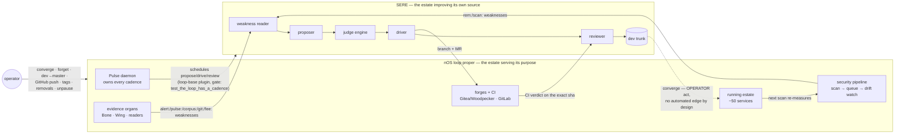
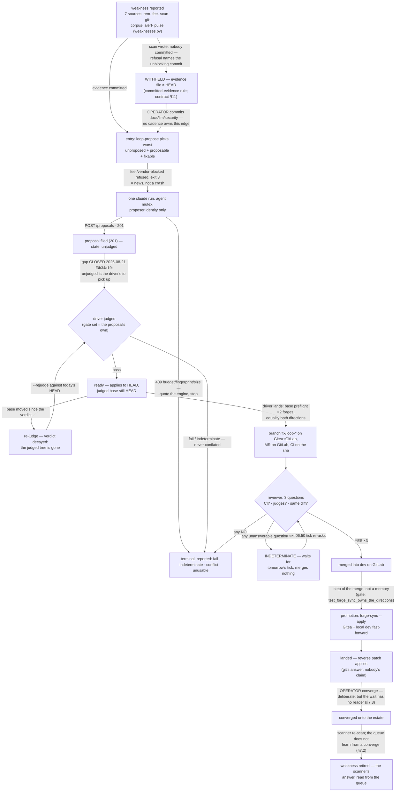
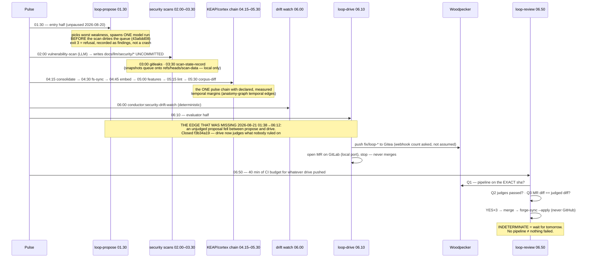
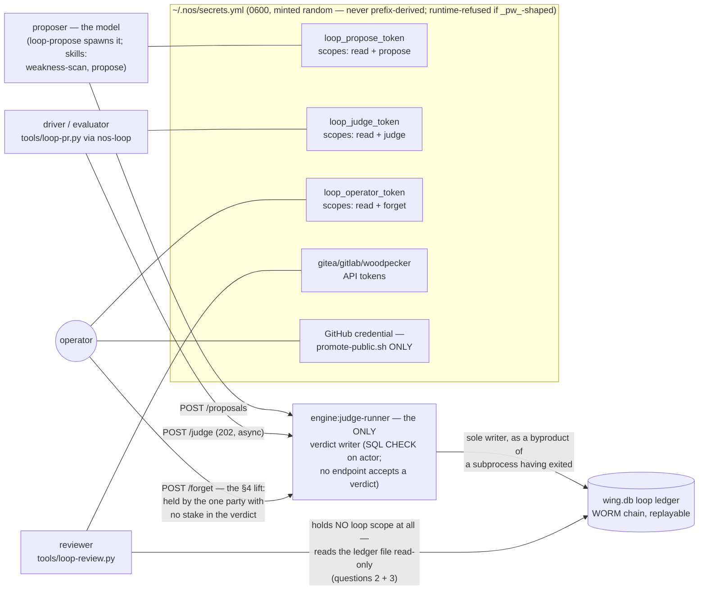
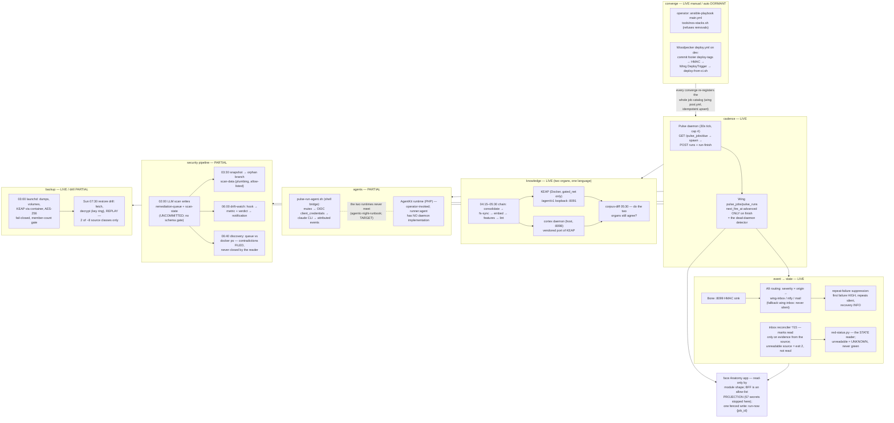
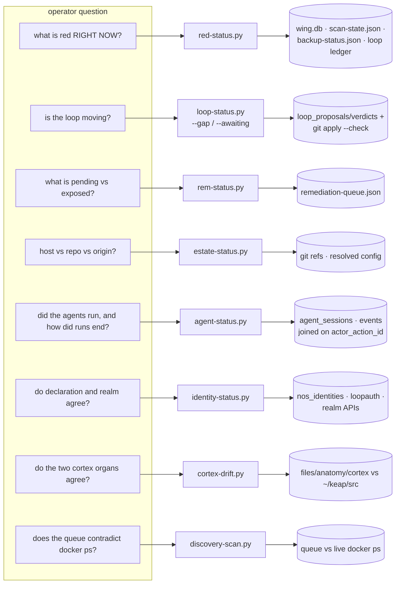

# The two loops — diagrams and full accounts (companion)

> Companion to [`docs/doctrine/loops.md`](doctrine/loops.md), split out
> 2026-09-03. The doctrine file keeps the rules, refusals and the missing-edge
> ranking under stable section numbers; this file carries the verified Mermaid
> diagrams and the full narratives, verbatim, under the same numbers. Code
> cites the doctrine file's sections, never this one.
>
> **Legend, used in every diagram.** Solid arrow = the edge exists and was
> verified against the repo (the pinning gate or measurement is named in the
> label or the surrounding prose). Dashed arrow = **partial or TARGET** — it
> does not fully exist, and drawing it solid would be the defect class the
> doctrine is about. Where a claim could not be verified, the diagram says so
> in place. Every date is a measurement, not decoration.

## 0. The night of 2026-08-20→21, in full

On the night of 2026-08-20→21 the loop ran unattended for the first time.
`loop:propose` filed a real proposal at 01:38. `loop:drive` at 06:12 reported
"no passed proposal is waiting to land" — and it was right: a fresh proposal
has no verdict, the reader listed only passed rows, and the driver acted only
on those. **Nothing joined the step that makes a proposal to the step that
lands one.** The gap survived a full day of attended use because a human judged
every proposal within a minute of filing it — a person was silently an edge in
the graph, and the omission surfaced only when he went to bed. (Closed the next
afternoon: `f3b34a19`, §3.4 puts judging on the driver; gates
`test_a_passed_verdict_is_never_silent.py`,
`test_the_driver_lands_without_merging.py`.)

## 1. Two loops — the overview diagram

## 2. SERE — the state-machine diagram

## 3. The unattended night — the cadence as a clock

All times as committed in the manifests (one shared clock; the load-bearing
facts are the *order* and the *margins*, not the wall time). Verified against
`files/anatomy/plugins/*/plugin.yml` and `files/anatomy/agents/conductor/agent.yml`.

Also on the clock, business-loop side: 03:00 the backup itself (launchd
`eu.thisisait.nos.backup.rustfs` — deliberately off the Pulse clock), 04:00 Sun
conductor self-test ceremony, 04:17 audit-chain verify, 04:20 npm-supply-chain,
05:30 authentik-tofu-drift, 06:23 agent-cost tally, 06:40 discovery
contradiction-scan, Sun 07:30 backup-restore drill; every minute the Wing
notify dispatcher, every 15 min alert-relay + inbox reconciler, hourly
breach-deadline scan; 09:00 the mail digest. The loop's three jobs sit
*between* the business jobs and consume their output — which is why the
ordering is part of the contract, and why the loop chain having **no declared
temporal edges** while the KEAP chain has five measured ones is a finding
(doctrine §7), not a style note.

## 4. Identities — the credential diagram

## 5. The nOS loop proper — the organ diagram

## 6. The evidence graph — the question→reader→artifact diagram

## 7. Missing and weak edges — the full accounts

0. **propose → drive** (`unjudged` fell between the steps) — **CLOSED
   2026-08-21** (`f3b34a19`), exercised the same afternoon: `813d458b` was
   picked up and judged `fail` on the `repo` set. Cost already paid: one
   silent night, plus the day of diagnosis.
1. **`requires_operator` is stamped and consumed by nobody.** The ledger
   marks every `gate-add` proposal `requires_operator=1` (contract §5a:
   "never auto-accepted"), and — verified — neither `loop-pr.py` nor
   `loop-review.py` reads the column. If a gate-add proposal ever passes a
   judge set, the unattended night lands and merges a model-authored gate
   with no operator anywhere in the chain: the "gate you can satisfy by
   editing the gate" class, through the front door. **MISSING refusal edge**;
   cost = the loop's one explicitly-forbidden automation, performed silently.
2. **landed → retired: the queue does not learn from a converge.** The
   scanner is the only retirement writer, twelve rows were already LIVE at
   their fix version, and REM-178 found a recorded fix *below* what runs.
   Cost: the loop re-proposes against fixed weaknesses (each queue edit moves
   the evidence sha, lifting retry ceilings), and the exposure story misleads
   in both directions. `discovery:contradiction-scan` sees part of it and may
   only file. **WEAK** — surfaced, not joined.
3. **The post-merge waits have no standing state.** An MR stuck
   INDETERMINATE (no pipeline, dead webhook) waits politely forever — the
   reviewer is right to wait, but `red-status` reads the ledger and git, not
   open MRs, so day three looks like day one. Same shape one step later:
   nothing counts "merged N days ago, never converged" per item
   (`estate-status` shows aggregate drift only). Cost: last night's class,
   relocated one edge downstream — waiting indistinguishable from done.
4. **The cadence order is enforced by two cron numbers and nothing else.**
   `pulse:loop:{propose,drive,review}` are orphan nodes in
   `state/anatomy-graph.json` — zero `depends_on`, zero temporal edges —
   while the KEAP chain carries five *measured* margins. The
   propose-before-scan ordering (`43a6dd08`) and the drive→review 40-minute
   CI budget are load-bearing and invisible to the margin analyzer. Cost:
   any schedule edit can silently reorder the night; the estate already owns
   the machinery that would catch it.
5. **The withheld-evidence unblock is a human edge with no owner.** The
   02:00 scan dirties `docs/llm/security/*`; the ledger (correctly) withholds
   `rem:` rows until someone commits; `loop-propose` refuses with exit 3 and
   names the fix. Surfaced everywhere, owned nowhere — the deadlock recurs on
   the scan's own cadence. (The 03:30 `scan-data` snapshot commits to an
   orphan branch the ledger does not read — nearby, but not this edge.)
   **WEAK**: cost = the entry half starves on any day the operator forgets.
6. **The security producer is an LLM writing an ungated artifact.** Everything
   downstream — weakness reader, drift watch, rem-status, the loop's own
   entry — consumes `remediation-queue.json`/`scan-state.json`, and no schema
   or cross-field gate validates the write (the reader's freshness
   corroborator catches *some* self-report contradictions — it filed
   `freshness:remediation-queue:not-corroborated` — but that is a spot check,
   not a contract). **WEAK**.
7. **AgentKit and Pulse never meet** (`runner: agent` is schema-only; every
   scheduled ceremony rides the shell bridge, and all but the weekly
   conductor self-test are paused; the bound loop is measured unproven —
   `test_the_bound_agent_loop_is_unproven.py`). Deliberate and documented,
   so **TARGET** rather than defect — but it is the business loop's own
   propose-drive-shaped seam, and it is drawn dashed in doctrine §5.
8. **The restore drill replays 2 of ~8 source classes** (keap-db, wing-db).
   MariaDB/Postgres dumps, volumes, dirs, tofu state, blueprints are fetched
   nightly and never round-tripped; the off-site restic copy has never been
   restore-verified. **PARTIAL**: cost appears exactly once, at the worst
   possible time.

## 8. Edge gates — the first three, in full

1. **The unattended path refuses `requires_operator`** — closes doctrine
   §7.1, the only edge whose absence violates an explicit contract clause.
   Fixture: a passed gate-add proposal in a scratch ledger; assert the driver
   reports it and refuses to land, and the reviewer refuses the MR.
   Retro-verify by removing the refusal and watching a model-authored gate
   sail through.
2. **Every ledger state has an owner** — the generalisation of `f3b34a19`.
   Derive the producible state set from the reader itself (`STATE_GLOSS` /
   `_STATE_ORDER` in `tools/loop-status.py` are literal data) and assert each
   state is either consumed by a named actor (driver, operator surface) or
   declared terminal with a reason. A new state added without an owner goes
   red on the day it is added, not on the first unattended night.
3. **The cadence chain is declared, and its margins are measured** — closes
   doctrine §7.4 with machinery that already exists: declare `depends_on` on
   `loop:drive` (→ propose) and `loop:review` (→ drive) plus the
   propose-before-scan constraint, and let `anatomy-graph-gen` +
   `test_anatomy_graph_is_sound` + the margin analyzer treat the loop chain
   exactly as they treat the KEAP chain. Two manifest lines and one gate
   extension; the night's order stops being two cron numbers.

The standing-state reader for doctrine §7.3 (unjudged/indeterminate/unconverged
items older than one cadence period reaching `red-status`) is the right
*fourth* move — it is a reader plus a fixture gate, and it converts every
remaining wait in the §2 diagram from an event into a state.

## 9. Toward a derived ontology

The doctrine file is hand-drawn and STATIC on purpose — the sequence needed
stating once, by a person, with the false edges left out. But most of what it
draws is already data, and the estate already owns the derivation pattern:
`tools/anatomy-graph-gen.py` → `state/anatomy-graph.json` (213 nodes, 252
edges, five kinds: `data`, `trigger`, `temporal`, `mutex`, `governed_by`),
gated by `test_anatomy_graph_is_sound.py`, rendered by the face's
`GraphView.svelte`, and projected to the public apex only through the signed
ruling (`files/anatomy/apex/ruling.yml`). The loop's steps are already nodes
there; what the unattended night's gap looks like in that artifact is precise:
**three `pulse:loop:*` nodes with no edges between them.**

For the visualisation step to be mechanical rather than a rewrite, the graph
needs two edge kinds the doctrine currently carries as prose:

- **`handoff`** — producer → artifact → consumer, e.g. `pulse:loop:propose →
  table:loop_proposals → pulse:loop:drive`, `pulse:loop:drive →
  repo:gitlab-mr → pulse:loop:review`. Derivable today for the loop: the
  states from `STATE_GLOSS`, the forge coordinates from `FORGE_KEYS`, the
  artifact names from the tools' own module constants — all literal data.
- **`identity`** — actor → credential → scope. Derivable today:
  `loopauth.IDENTITIES` is a literal dict; `authentik_agent_clients` and
  `nos_identities` are committed YAML; the reviewer/driver token keys are
  module constants. §4's diagram becomes a projection.

The evidence graph (§6, question → reader → artifact) is the least mechanical
— the join lives in the readers' docstrings — and can stay curated the way
`REPO_SURFACES` already is: each node pinned to the code that touches it.

This belongs **in** `anatomy-graph-gen`, not beside it: same address space,
same byte-stable artifact, same gate, same renderer, same apex ruling
(default WITHHELD, so nothing here leaks by default). When those edges become
data, the diagrams above become checkable against the graph — and the doctrine
file shrinks to the prose and the refusals, which is what doctrine is for.
