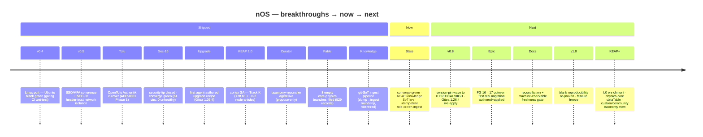

# nOS roadmap

Canonical, prioritized roadmap — the single forward-planning surface. Supersedes
the scattered ones (`active-work.md` is the NOW pointer only). Produced by an
8-agent state-of-nOS audit (2026-07-07), **revised 2026-07-08** (security-batch +
converge-green) and **2026-07-14** (KEAP knowledge pipeline + a plan-doc triage:
the 59 `docs/plans/` were surveyed, 14 done/resolved archived, opens folded into
the backlog below). Grounded in code + git + the live install, not the docs.

## The through-line

nOS's engineering is **weeks ahead of its documentation**. The reset-scope +
session-safety work (Phases 0-4), macOS-as-managed-upgrade (Inc 1-3c, **live-validated**
on a real 26.3.1→26.5.1 update), and migration-author Phase-4 all shipped to `dev`
but appear in no changelog. The agent runtime + coexistence frameworks are genuinely
mature — but their **headline acceptance criteria are unexercised** (no real migration
authored; PG 16→17 never cut over end-to-end).

The **security ground-truth crisis is resolved** (2026-07-08): the cycle-16 queue is
committed, and the live-exploitable CRITICAL (FreeScout REM-118, CVSS 9.4 unauth
takeover) is **patched + verified on-host**, alongside Bone unauth recon (REM-110),
Alloy unauth OTLP (REM-107), and the three degraded services that were failing the
STRICT health gate (qgis, gitlab-VirtioFS, puter). **The converge is green** (61
containers, 0 unhealthy).

What remains is **burn-down + epic acceptance**: a version-pin wave (one CRITICAL
left after Gitea — a Woodpecker misconfig), the never-exercised upgrade/migration
acceptance criteria, and a large **doc-reconciliation** debt so an agent or
contributor stops taking the stale docs as source-of-truth.

## Trajectory (timeline)

> Living chart — last ~10 breakthroughs → current state → planned steps. Update on
> every bigger roadmap change.

## Road to first stable (v1.0)

**What "stable" means** — v1.0 is the general self-hosted platform reaching
production-trust for a single-operator home lab. It is NOT gov-readiness (ISDS/
NIA/eIDAS/retention stay a profile-gated post-1.0 track) and NOT full Linux
parity (OpenClaw/Hermes/fleet are post-1.0). Exit criteria (definition of done):

1. **Security floor** — zero CRITICAL/HIGH in the remediation queue on a fresh
   full scan. Vendor-blocked FreePBX = documented accept-risk (`install_freepbx:false`
   default). The pin wave is burned to zero.
2. **Reproducible blank** — `blank=true` installs the known-good profile
   end-to-end `failed=0`, every container healthy, on a genuinely clean host.
   This is the core nOS invariant and must be re-proven at the RC.
3. **Epic acceptance exercised on real workloads** — (a) a same-org upgrade
   applied live (Gitea 1.26.4 ✅ armed, apply-validate pending); (b) a real
   migration authored *and applied*; (c) one coexistence cutover completed
   end-to-end (PG 16→17). These prove the frameworks, not just their tests.
4. **CI fully green incl. the gating Integration wet-test** (Linux + macOS lanes).
5. **Healthcheck coverage** — STRICT `wait-stacks-healthy` gates *every* service
   (no booted-but-broken container passing as `running=ready`).
6. **Docs reconciled + a freshness gate** — CLAUDE.md / roadmap / RELEASE / active-work
   mutually consistent; a machine-checkable staleness gate so NOW can't silently rot.
7. **Feature freeze** on the beta service surface during stabilization.

**Milestone sequence** (tags cut from `master`, operator-validated per
`nos-release-flow`):

- **v0.7-beta (2026-07-09, this tag)** — security tip closed, converge green,
  first agent-authored upgrade recipe (Gitea). CI green.
- **v0.8-beta — "burn-down"** — version-pin wave → zero CRITICAL/HIGH; Gitea 1.26.4
  live-applied; `fix/sso-mfa-posture` (8 live-bug fixes) + sso-autologin epic merged;
  healthcheck coverage for the health-blind containers; Bone dep-lockfile.
- **v0.9-beta / RC — "epic acceptance"** — PG 16→17 cutover done end-to-end; first
  real migration authored + applied; doc reconciliation complete + freshness gate;
  Integration wet-test green on both OS; **blank reproducibility re-proven**.
- **v1.0.0 (stable)** — all exit criteria met; feature freeze; gov + Linux parity
  explicitly scoped as post-1.0 tracks (v1.x / a gov edition).

**Nearest critical path to v1.0:** finish the pin wave (esp. REM-002 Woodpecker
CRITICAL) → apply+validate Gitea 1.26.4 live → PG 16→17 cutover (unblocks epic
acceptance + the first real migration) → healthcheck coverage → RC blank re-prove.

## Shipped this session (2026-07-08) — reconcile into changelogs

- **Security queue committed + reconciled** (was uncommitted working-tree truth).
- **REM-118 FreeScout** → `nfrastack/freescout:2.1.3-php8.3` (app 1.8.226 > 1.8.224
  fix); cross-org migration (tiredofit EOL) + `SITE_URL`→`APP_URL`. Live healthy.
- **REM-110 Bone** → `require_scope(nos:state:read)` on services/status/health-aggregate
  (liveness stays open); **PyJWT floor → 2.13.0**. Live 401/200.
- **REM-107 Alloy** → `alloy_otlp_bind_addr` var (default `127.0.0.1`), both config
  copies. Live loopback bind.
- **qgis** restart-loop → idempotent entrypoint guard **+ `command:` restore**
  (compose `entrypoint:` clears the image CMD). Live running.
- **gitlab VirtioFS puma loop** → tmpfs over `/var/opt/gitlab/gitlab-rails/sockets`
  (socket off VirtioFS → no more `realdirpath ENOTSUP`). Live healthy, 0 errors.
- **puter** telemetry-preload crash → `command:` override drops the `-r telemetry.js`
  preload (base image stopped bundling `@opentelemetry/auto-instrumentations-node`).
  Live "PuterServer fully booted".
- **First real upgrade recipe** `upgrades/freescout.yml` (converge-driven for the
  cross-org bump; full backup→verify→rollback for future same-org 2.x bumps).
- Queue tally: **pending 36 / resolved 79 / vendor-blocked 3** (of 118).

## Shipped this session (2026-07-09) — reconcile into changelogs

- **Gitea 1.25 EOL → 1.26.4 (REM-099) — first agent-authored upgrade recipe**, driven
  end-to-end through the Wing/AgentKit agents (upgrade-architect + migration-author),
  operator-supervised. Architect live-corrected two ticket assumptions (sqlite not
  MariaDB; `/api/healthz` not `/-/readiness`). `upgrades/gitea.yml` + migration record
  + shadow-pin bump. Armed at 1.26.4; live-apply pending operator converge.
- **CI red→green** — CI had been red on `dev` 3 commits: a pytest module-shadow
  (`tests/upgrades` shadowing Bone's `upgrades.py` + sibling `migrations`/`state`)
  and stale contract snapshots (bone/wing OpenAPI + wing DB-schema). Both fixed;
  full suite 2301 passed / 0 errors, contracts idempotent.
- **v0.7-beta prepped** — RELEASE.md expanded (arc 1 idempotency + arc 2 security/
  converge-green/first-recipe), `active-work.md` re-anchored (was 3+ weeks stale),
  this roadmap given a **Road-to-v1.0** section. Tag pending operator validation converge.
- Live re-verified: converge `failed=0`, 61 containers / 0 unhealthy, e2e **10/10**.

## Shipped this session (2026-07-14) — KEAP knowledge pipeline

- **Fable ontology review** — one `claude-fable-5` pass (no sub-agents, full context)
  blessed the L0-2 spine (0 edits) and authored **529 records** filling the 8 empty
  named core-physics branches (`01.01.03`-`.10`), EN + flawless CS. Live in the corpus.
- **Curator agent** live (propose-only taxonomy reconciler; full L≥3 sweep, convergence
  proven) — see memory `keap-curator-agent-build`.
- **Git-SoT knowledge pipeline** (`docs/plans/keap-knowledge-ingest-pipeline.md`) — the
  live DB is now populated *from git*, idempotently, by the `pazny.keap` role:
  - `knowledge/canonical/<L0>/<L1>.json` = the SoT (95 files / **1565 curated records**
    / 2231 relations), captured by `knowledge/dump.mjs` — including **770 seed-override
    descriptions** (the Track K node-articles that had lived DB-only).
  - `knowledge/ingest.mjs` = single idempotent import (per-file sha256 marker in
    `knowledge_imports`; `--dry-run`); replaces the per-domain importers.
  - **Round-trip identity proven** (`ingest→dump→diff==0`, CI-gated) + `lint.mjs`
    (schema/house-style/no-Cyrillic) — the keap repo's first CI.
  - Role wiring VALIDATED live: RO bind-mount of canonical, ingest after health-wait,
    conditional restart, embed-sync kick. First converge applied 95 domains + markers;
    re-run = 0 applied / 95 skipped (idempotent); corpus 1585 nodes intact.
  - Dockerfile simplified — image ships *tools not data* (kills the per-file COPY
    manifest); data changes ride the git ref, no image rebuild.

## NOW — the immediate queue

1. **[operator] Validate + apply on-host** — run `ansible-playbook main.yml` (or blank)
   to live-apply the armed Gitea 1.26.4 upgrade under STRICT health-wait. If `failed=0`,
   cut `v0.7-beta` (`dev→master` PR + admin bypass, `nos-release-flow`).
2. **[M] Version-pin drift wave — ~28 pending `version_bump` items** (Gitea done),
   **one CRITICAL left: REM-002 Woodpecker misconfig**. The rest are mechanical
   HIGH/MEDIUM bumps (nginx, ollama, rustfs×2, openwebui, mariadb, redis, n8n,
   **gitlab REM-016 → 18.11.7** (re-scan moved the target), erpnext, jellyfin FFmpeg,
   portainer, dnsmasq, mailpit, outline, homeassistant, uptime-kuma, tileserver, puter).
   Bump `default.config.yml` (wins over role defaults), then **verify the running image
   tag** (version-pin-shadow trap). Use the Gitea recipe as the template for same-org bumps.
3. **[S] Doc reconciliation tail** (§ below) — active-work counts ✅ + RELEASE July
   section ✅ done this session; remaining: plan-header lags, archive the resolved
   `v07-*` dumps.

## Backlog

### P0 — roadmap truth (security truth now closed)
- **Doc reconciliation** (NOW #3) — fix the counts in CLAUDE.md:350 + active-work.md
  (still claim the stale 14/71/2-of-87) and add the 2026-07-08 shipped list.
- **Refresh the CVE full-scan baseline** — `scan-state.json last_full_scan` is past
  the 14-day drift-hook threshold; a fresh full scan re-grounds the 36-pending set.
- **Re-anchor active-work.md + v0.7-beta** (NOW #2).

### P1 — burn-down + the epic's own acceptance
- **[M] Version-pin drift wave** (NOW #1, 29 items incl. REM-099/002 CRITICAL).
- **[M] Gitea 1.25.x EOL → 1.26 migration** (REM-099) — a major-line bump via an
  **upgrade recipe**. Cleaner than FreeScout as a recipe-engine exercise: **same org**,
  so `compose.set_image_tag` fully drives it (no template org-swap), truly exercising
  the `--tags upgrade` backup→apply→verify→rollback path end-to-end.
- **[L] PG 16→17 end-to-end cutover** through the agent flow — the upgrade epic's OWN
  acceptance criterion. pg17 verified live beside pg16 on the coexistence track, but
  the actual cutover (logical dump/restore + pointer flip) has never run. Framework
  shipped; needs operator-supervised execution.
- **[M] Author the first real migration** — `files/anatomy/migrations/` holds only a
  `_template` + one `_archived`; the Phase-4 reset propagation + `test_reset_floor.py`
  are forward guards that activate only when a real migration lands. PG 16→17 (or
  Gitea 1.26) is the natural driver.
- **[M] Merge `fix/sso-mfa-posture`** — 8 live-bug fixes stranded off dev (firefly
  remote_user_guard 500, traefik dup-router 502, enrollment blueprint idempotency, …).
- **[M] Promote the sso-autologin epic** (dev-only, dormant behind `sso_autologin:false`)
  to master + reconcile its plan doc.
- **[S] Bone dep-lockfile** — pin fastapi/uvicorn/httpx/PyYAML/PyJWT to a lockfile
  (mirroring wing `composer.lock` discipline); the REM-110 PyJWT floor bump landed but
  the full supply-chain pin is the remaining folded-in ask.
- **[L] Retention enforcement (gov P0-5)** — `retention_days` is descriptive metadata
  only; actual purge reaches only `wing.db` events. Application DBs / Qdrant / Redis /
  agent_* tables are unpurged.
- **[S] Infisical MTI oauth2/proxy orphan render fix** — the aggregator still emits an
  orphan OAuth2Provider for a forward_auth service; reappears every apply.

### P2 — feature tails + robustness
- **[M] VirtioFS class-risk doctrine** — the gitlab puma socket is **fixed** (tmpfs,
  this session), but the pattern is a class-risk: consolidate the ~6 scattered VirtioFS
  workarounds behind a doctrine doc + pytest gate + greppable `# VFS-DOCTRINE:` markers
  so a Darwin-27 bind-semantics tightening is detectable, not silent. See
  `docs/plans/v07-darwin27-virtiofs-filesystem-workaround.md`.
- **[M] Healthcheck coverage** for the health-blind containers (freescout, calibre-web,
  homeassistant, nextcloud, wordpress, infisical, portainer, …) so STRICT
  wait-stacks-healthy actually gates them (this session, freescout/qgis/puter/gitlab
  came up but only some expose a real HEALTHCHECK; the wait treats no-healthcheck as
  "running=ready", a coverage gap).
- **[L] Close the conductor loop** — cadence auto-dispatch of downstream agents (today
  it reports but never auto-fires remediator/upgrade-advisor/migration-author). Needs
  operator sign-off on autonomous dispatch.
- **[L] Migrate the 5 CLI-wrapper agents to native AgentKit** (only migration-author
  runs native today).
- **[L/XL] Unblock inspektor** (trivy/grype/nuclei substrate) + **librarian** (Qdrant
  corpus ingest) — both contract-only, waiting on greenfield substrates.
- **[M] reset-scope blank wet-test + thin run_mode=detached UI auto-route** — the two
  named remainders of the upgrade epic.
- **[M] macOS Inc 4** — `upgrades/macos.yml` first-class host_reboot recipe (resolve the
  reboot-spanning recipe-modeling question first).
- **[L] Erasure automation depth** (Art-17: 26/29 entries still `method:manual`; backups
  never subject-purged) + DSAR/export bundle encryption.
- **[M] RustFS / OpenWebUI / Woodpecker CVE clusters** (pending, not vendor-blocked).
- **[M] Wing-on-Linux validation** (drop the `install_wing:false` stale workaround).
- **[S] Roadmap consolidation** — ✅ 2026-07-14: the 59 plan docs were triaged (2-agent
  survey); 14 done/resolved moved to `docs/archive/`, the opens folded into this backlog
  (below). Remaining: **add a machine-checkable active-work freshness gate** (the 150-line
  ceiling is pinned but nothing pins freshness — which is why it drifted 3+ weeks).
- **[M] macOS 27 forward-compat hardening** — one epic folding the 14 `v07-darwin27-*`
  notes. **6 useful now regardless of macOS 27:** Docker-Desktop version-floor preflight,
  mkcert CAROOT single-source + CA-present assert, macOS/arch version-gate preflight,
  hard-pin `interpreter_python` (defeat auto-discovery custom-module crash), version-pin
  Ollama (currently `state:latest`) + llama-server preflight, modernize the `launchctl`
  load path. Forward-horizon: py3.14 workaround consolidation, VirtioFS doctrine (above),
  the 2.24 jump (tech-debt), Homebrew tap/pmset/softwareupdate/TCC-sandbox guards.
- **[M] native_oidc runtime-verify + regression gate** — one epic folding the 7 `v07-sso-*`
  notes: file/API-driven native_oidc services (Home Assistant `auth_oidc`, Jellyfin
  `SSO-Auth.xml`, Nextcloud/Gitea) render config but have **no loud runtime-load verify**,
  so a silent failure regresses SSO invisibly. Add post-setup verify + gate; pin the
  order-sensitive Jellyfin XML schema; strengthen `test_sso_doctrine.py` to assert wiring
  not just the mode label; gate the Superset/Metabase SSO-ceiling classifications.
- **[M] State-drift reconciliation + restart-handler fail-loud** — (a) observed state
  drift is computed then dropped; escalate/reconcile it. (b) Re-apply the 49 broken
  docker-restart handler commands' fail-loud (supersedes the reverted `992dfab9`).
- **[S] Small hardening tail (folded v07)** — central docker log-rotation default across
  the 63 compose `logging:` blocks; WordPress unauth-surface block/rate-limit at Traefik
  (REM-114); Uptime-Kuma 1→2.2.1 SSTI recipe (REM-073); FreePBX risk-acceptance flag
  (fail-closed, CVE-cited); Authentik `2026.5.2` pin propagation (3 drifted surfaces);
  Tier-2 apps_runner update-semantics gate; blank-reset external-storage + nginx-dir
  contract gates; WP RBAC last-admin floor; advisor/architect name-contract pin.
- **[L/XL] KEAP custom taxonomy view + community cloud push** — the git-SoT knowledge
  pipeline (`docs/plans/keap-knowledge-ingest-pipeline.md`) ships the **community** view
  (curated, git-tracked, hardcoded today). Deferred: a per-user **custom** view that
  applies the user's *local taxonomy proposals* on top of community (edits are proposals,
  never direct mutations), and a **community-cloud push** that promotes accepted proposals
  upstream — "democratisation of positions." Turns today's hardcoded community graph into
  a community-governed one. Also: **user-data hot-reload** (non-taxonomy data materialises
  live, no restart) vs. the core-taxonomy git-ingest+restart path.
- **[M] KEAP L0 description enrichment** — the 12 top-level sciences (`01`-`12`) carry only
  terse seed strings in `src/game/data/taxonomy.ts` (e.g. "Study of natural phenomena"),
  NOT the rich Track-K node-articles L1+ got, and are absent from `knowledge/`. Enrich all
  12 to Track-K depth as `seed-override` records in canonical (or migrate the whole L0-2
  seed-description layer out of the hardcoded TS into `knowledge/` — end the split SoT).
- **[M/L] KEAP physics-core dataTable** — formulas (LaTeX), discoverers/authorities, and
  scientific citations (DOI) are *structured* data that fit the prose description/brief
  layer poorly. Model them as KEAP **dataTables** (e.g. `physics-formulas`: node_id, name,
  latex, discoverer, year, doi; plus `authorities`/`citations`), attached to taxonomy nodes
  by node_id — a structured data layer beside the taxonomy/description SoT. Same pattern
  generalises to other exact sciences.
- **[M] KEAP knowledge-quality follow-ups (from the 2026-07-14 holistic fable review)** —
  (1) **deep Czech backfill**: ~322 L4 leaves still lack `cs`, concentrated in the four
  deeply-grown domains (01.01/01.02/01.03/02.01) — a verified translation pass. (2) **lift
  brief `[[id]]` cross-links into first-class typed `relations`** (economics/geoscience/
  mechanics briefs already carry them) — a low-risk coherence gain. (3) **fill the sparse
  preservation half** (L0 domains 03–12, esp. 09–12 single-node stubs — KEAP's namesake)
  with real `ext` subtrees. L0 enrichment (the 12 top-level node-articles) shipped
  2026-07-14 on `feat/l0-enrichment`.
- **[L] KEAP semantic lens over the star-map** — every node has a 768-dim embedding
  (local Ollama, `keap-embed-sync`, libSQL vector layer); use it to drive the star-map's
  *appearance* channels without touching position. The U1 positions are structural (the
  taxonomy tree) and baked/append-only — so embeddings must NOT move stars, but color/
  size/texture/rotation are free. Derive interpretable **semantic axes** two ways: (a)
  dimensionality reduction (PCA/UMAP/t-SNE) 768→2-3 axes = statistically-optimal but
  unnamed; (b) **difference-vector axes** `embed(A)−embed(B)` between exemplars =
  interpretable + more stable (concrete↔abstract, micro↔macro scale, empirical↔formal,
  static↔dynamic), then project each node. **Channel map:** size→centrality (mean cosine
  sim to neighbours / distance from domain centroid, or embedding norm); hue→projection on
  a semantic axis (gradient); texture/material→categorical facet (k-means cluster over
  embeddings); rotation→embedding direction vs a chosen axis. **Architecture:** an offline
  job beside `keap-embed-sync` computes the projections → stores a few scalar "derived
  features" per node → `GraphCanvas` maps them to channels behind a "semantic lens on/off"
  toggle (like the relations toggle) — a few scalars per node, never 768-dim in the
  renderer. **Split that makes it clean:** embeddings drive appearance only; positions stay
  tree-baked (U1 intact). Stability: fixed-exemplar axes beat PCA (which recomputes with the
  corpus); a rewritten description shifts colour/size — acceptable, and the derived-features
  job re-runs with embed-sync.
- **[L/XL] KEAP node metadata + external dataset linkage (linked-data cortex)** — enrich
  each node beyond description/brief with structured metadata: **dates** (discovery / key
  events → a temporal axis + timeline render), **schema.org typing** (nodes become typed
  entities — `ScholarlyArticle`, `Person`, `Event`, `Dataset`, … → entity-type facets +
  typed celestial forms), and **links to external educational/scientific/professional
  datasets** (open corpora, possibly Spark-processed). Turns the taxonomy into a linked-
  data knowledge graph and unlocks a whole new tier of **lenses** (recency, entity-type,
  provenance, citation-count) and **renders** (temporal orbits, typed bodies). Storage:
  a `node_metadata`/JSON-LD layer beside `node_features`; the git-SoT canonical format
  gains an optional `meta`/`links` block. Big epic — scope after the render hierarchy lands.
  **Enrichment spine (KB survey 2026-07-15):** each KEAP node is an abstract *concept*, so
  the spine must be a concept/entity KB, not a paper KB. Recommended stack — (1) **Wikidata
  QID** as the primary external key (CC0; the LOD hub — one ingest reaches MeSH/Getty/GeoNames/
  DOI/ORCID/OpenAlex via typed ID properties; richest temporal vocab anywhere: inception P571,
  *discovery date* P575, *point in time* P585 → directly powers the cross-time edge heuristic);
  (2) **YAGO 4.5** as the schema.org-typing + clean-taxonomy overlay (native schema.org top
  classes, joins 1:1 to the QID spine — turns "typing via messy P279 chains" into real typed
  entities; license flag: CC-BY-**SA** share-alike, resolve before redistributing enriched
  metadata); (3) **OpenAlex** for the science branches' scope-signal + dataset links (CC0, the
  *only* natively-Spark candidate — ships **Parquet on S3**; `cited_by_count` = a real
  citation-count node-size driver; Domain→Field→Subfield→Topic maps onto science sub-trees);
  (4) **QRank** (CC0, tiny QID→popularity-rank CSV from Wikimedia pageviews) as the *universal*
  node-size driver for the non-science half where OpenAlex citations don't apply — **verify the
  qrank.wmcloud.org source still lives before committing**. Attach-don't-spine: DataCite/Crossref
  (CC0) for outbound dataset/work links via DOI; MeSH/Getty AAT/GeoNames pulled per-node only
  where Wikidata already carries the cross-ID. Avoid as spine: BabelNet (non-commercial + no open
  dump), ORKG (coverage too sparse), DBpedia (redundant w/ Wikidata, noisier). **Spark note:**
  only OpenAlex is Parquet out of the box; budget a one-time RDF/JSON→Parquet conversion for the
  101 GB Wikidata bz2 + YAGO Turtle (single-threaded decompress isn't Spark-native).
- **[M] KEAP relation-layer lenses (edge switching)** — links render primarily as the
  **taxonomy tree** (structural spine); a future lens switches the edge layer to other
  relation types (typed `brief-xref`/research relations, semantic-similarity k-NN,
  temporal precedence, cross-domain bridges). The "Vazby" toggle is the seed; generalise
  it into a lens-driven edge-layer picker (tree ↔ relations ↔ similarity ↔ …).
  **Cross-time / cross-distance link heuristic (inspiration, 2026-07-15):** the most alive
  edges aren't nearest-neighbour — they leap across *time* or *domain* (a modern concept
  wired to a centuries-older ancestor, physics↔biology bridges). A curator/librarian agent
  should explicitly propose "connect over temporal/domain distance", not just cosine-closest
  siblings. This only becomes computable once nodes carry **dates** and **cross-KB identity**
  — so it lands *with* the schema.org + external-dataset (Spark) enrichment epic above, not
  before: temporal precedence edges come from the metadata `dates`, cross-domain bridges from
  shared external identifiers / typed relations. (Seed idea from an Obsidian+MCP PKM writeup;
  the mechanic maps onto our lift-xrefs + relation-layer picker.)
- **[S] KEAP brief-xref render gate** — the 1696 `source='brief-xref'` typed relations
  (lifted from brief `[[id]]` links, 2026-07-14) render by default (`type != 'related-
  concept'`); gate them behind `source` or a dedicated toggle in `graph.ts`/SidePanel so
  the graph isn't over-dense.
- **[S] KEAP provenance-folder cleanup** — the pre-dump derivation artifacts
  (`knowledge/{physics,math,chem,bio,toe}/*-{blocks,scaffold,import,concept-graph}.json`)
  are superseded by `knowledge/canonical/` (the SoT). Decide together: retire them (git
  history preserves) vs. relocate under `knowledge/_provenance/` with a README. The physics
  folder is the odd one out (fable went straight to import bundles — no blocks/scaffold).

## Cross-cutting risks
- **VirtioFS is a class-risk, not a one-off** — the gitlab puma `realdirpath ENOTSUP`
  loop is now fixed (tmpfs), but the same bind-semantics gap could break other stateful
  containers on a Darwin-27 Docker Desktop tightening. No gate detects the pattern yet.
- **ansible-core 2.24 jump** is coupled to the `{{ vars }}` retirement (removed in 2.24);
  needs a dedicated pre-2.24 wet-test lane.
- **Epic acceptance unexercised** — the freescout recipe is the first shipped, but no
  real *migration* authored and PG 16→17 never cut over; latent bugs surface only on
  first real use of the same-org recipe / migration / coexistence-cutover paths.
- **Healthcheck blindness** — no-HEALTHCHECK containers pass the STRICT wait as long as
  they are `running`, so a booted-but-broken app (like puter was) can read as ready.
- **Gov P0s genuinely open** — retention metadata-only, ISDS + NIA/eIDAS greenfield; not
  gov-deployable for citizen-facing Czech use despite the structural controls.
- **FreePBX vendor-blocked CRITICALs** (REM-014/046/113, incl. 9.3 hard-coded creds)
  unfixable in the abandoned image; only `install_freepbx=false` mitigates.
- **Systemic doc drift** — an agent/contributor taking the docs as source-of-truth will
  re-plan shipped work or miss live-degraded services.

## Doc reconciliation
- **Security counts**: CLAUDE.md:~350 + active-work.md → **36 pending / 79 resolved /
  3 vendor-blocked of 118**. Vendor-blocked set = FreePBX-only (REM-014/046/113).
- **CLAUDE.md "Recently shipped"** — add the 2026-07-08 batch (REM-107/110/118 + qgis +
  gitlab-VirtioFS + puter + first upgrade recipe), reset-scope 1-4, macOS 1-3c
  (live-validated), migration-author Phase-4, sso-autologin epic. Fix the ERPNext bullet
  (role is PARKED, not flaky-with-retry).
- **RELEASE.md** — cut the v0.7-beta tag or demote; add a July section (os-resume /
  reset-scope / Phase-4 / the security batch).
- `docs/plans/macos-as-managed-upgrade-target.md` header — ✅ 2026-07-14: reframed to
  "SHIPPED, Inc 1-3c live-validated; Inc 4 open".
- `docs/plans/agentic-upgrade-migration-coexistence.md` header — ✅ 2026-07-14: reframed
  "VISION/DESIGN-FIRST" → "MID-BUILD Phase B; B7 pg16→17 open" (memory still to update).
- `docs/sso-autologin-plan.md` + memory — flip from greenfield to shipped-on-dev.
- `docs/sso-and-attribution.md` — stale "not running on schedule"; only inspektor +
  librarian are runner-less.
- Archive — ✅ DONE 2026-07-14: 14 done/resolved plan docs moved to `docs/archive/`
  (`adjustment-build-report`, `phase-b-build-report`, `agentic-upgrade-adjustments-design`
  + 11 resolved `v07-*`). Inbound refs repointed. 45 plan docs remain (active/open).
